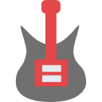

# JiTaMusic

<div width="300px" align="center" >
  
</div>

## Q&A

- About the color matching in app?

> They come from [Color Hunt](https://colorhunt.co/)

- About the icons in app?

> They come from [Alibaba vector icon library](https://www.iconfont.cn/)

- About the background in the play page?

> By using the [glide-transformations](https://github.com/wasabeef/glide-transformations) to blur the image.

## Demo show

<div width="100%">
  
  
</div>


## Main Directory tree

```
├─java
│  └─com
│      └─example
│          └─lenovo
│              └─simplemusicplayer
│                  ├─activities
│                  ├─adapters
│                  ├─entity
│                  ├─helpers
│                  └─util
│                      └─mp3
└─res
    ├─anim
    ├─drawable
    ├─drawable-v24
    ├─layout
    ├─mipmap-anydpi-v26
    ├─mipmap-hdpi
    ├─mipmap-mdpi
    ├─mipmap-xhdpi
    ├─mipmap-xxhdpi
    ├─mipmap-xxxhdpi
    ├─values
    └─values-v21

```
